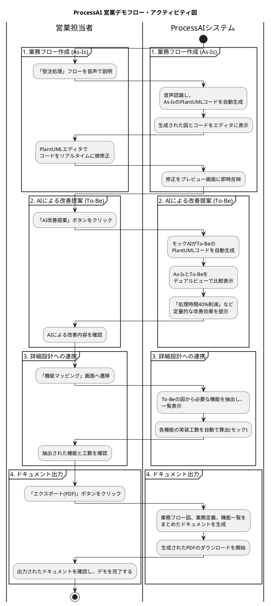

```plantuml
@startuml
title ProcessAI 営業デモフロー・アクティビティ図

|営業担当者|
|ProcessAIシステム|

start

partition 1. 業務フロー作成 (As-Is) {
    |営業担当者|
    :「受注処理」フローを音声で説明;
    |ProcessAIシステム|
    :音声認識し、\nAs-IsのPlantUMLコードを自動生成;
    :生成された図とコードをエディタに表示;
    |営業担当者|
    :PlantUMLエディタで\nコードをリアルタイムに微修正;
    |ProcessAIシステム|
    :修正をプレビュー画面に即時反映;
}

partition 2. AIによる改善提案 (To-Be) {
    |営業担当者|
    :「AI改善提案」ボタンをクリック;
    |ProcessAIシステム|
    :モックAIがTo-Beの\nPlantUMLコードを自動生成;
    :As-IsとTo-Beを\nデュアルビューで比較表示;
    :「処理時間40%削減」など\n定量的な改善効果を提示;
    |営業担当者|
    :AIによる改善内容を確認;
}

partition 3. 詳細設計への連携 {
    |営業担当者|
    :「機能マッピング」画面へ遷移;
    |ProcessAIシステム|
    :To-Beの図から必要な機能を抽出し、\n一覧表示;
    :各機能の実装工数を自動で算出(モック);
    |営業担当者|
    :抽出された機能と工数を確認;
}

partition 4. ドキュメント出力 {
    |営業担当者|
    :「エクスポート(PDF)」ボタンをクリック;
    |ProcessAIシステム|
    :業務フロー図、業務定義、機能一覧を\nまとめたドキュメントを生成;
    :生成されたPDFのダウンロードを開始;
    |営業担当者|
    :出力されたドキュメントを確認し、デモを完了する;
}

stop

@enduml
```