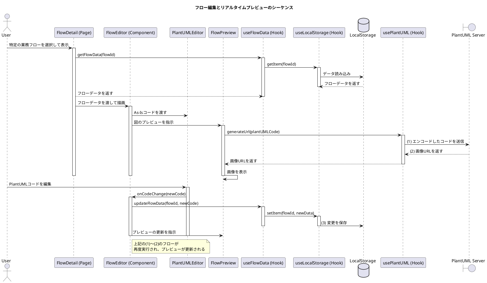

```plantuml
@startuml
title フロー編集とリアルタイムプレビューのシーケンス

actor User
participant "FlowDetail (Page)" as Page
participant "FlowEditor (Component)" as Editor
participant "PlantUMLEditor" as PumlEditor
participant "FlowPreview" as Preview
participant "useFlowData (Hook)" as FlowHook
participant "useLocalStorage (Hook)" as LocalHook
database "LocalStorage" as LS
participant "usePlantUML (Hook)" as PumlHook
boundary "PlantUML Server" as PumlServer

User -> Page : 特定の業務フローを選択して表示
activate Page

Page -> FlowHook : getFlowData(flowId)
activate FlowHook
FlowHook -> LocalHook : getItem(flowId)
activate LocalHook
LocalHook -> LS : データ読み込み
LocalHook <-- LS : フローデータを返す
deactivate LocalHook
FlowHook <-- Page : フローデータを返す
deactivate FlowHook

Page -> Editor : フローデータを渡して描画
activate Editor
Editor -> PumlEditor : As-Isコードを渡す
Editor -> Preview : 図のプレビューを指示

activate Preview
Preview -> PumlHook : generateUrl(plantUMLCode)
activate PumlHook
PumlHook -> PumlServer : (1) エンコードしたコードを送信
PumlServer --> PumlHook : (2) 画像URLを返す
PumlHook --> Preview : 画像URLを返す
deactivate PumlHook
Preview -> Preview : 画像を表示
deactivate Preview
deactivate Editor
deactivate Page

User -> PumlEditor : PlantUMLコードを編集
activate PumlEditor
PumlEditor -> Editor : onCodeChange(newCode)
activate Editor
Editor -> FlowHook : updateFlowData(flowId, newCode)
activate FlowHook
FlowHook -> LocalHook : setItem(flowId, newData)
activate LocalHook
LocalHook -> LS : (3) 変更を保存
deactivate LocalHook
deactivate FlowHook

Editor -> Preview : プレビューの更新を指示
note right of Editor : 上記の(1)～(2)のフローが\n再度実行され、プレビューが更新される

deactivate Editor
deactivate PumlEditor

@enduml
```