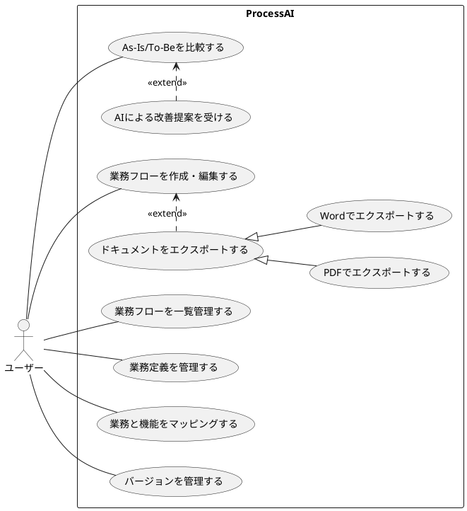

```plantuml
@startuml
' --- レイアウト設定 ---
left to right direction
skinparam packageStyle rectangle

' --- アクター定義 ---
actor ユーザー

' --- システム境界とユースケース定義 ---
rectangle "ProcessAI" {
  usecase "業務フローを一覧管理する" as UC_List
  usecase "業務フローを作成・編集する" as UC_Edit
  usecase "As-Is/To-Beを比較する" as UC_Compare
  usecase "業務定義を管理する" as UC_Define
  usecase "業務と機能をマッピングする" as UC_Map
  usecase "バージョンを管理する" as UC_Version
  usecase "ドキュメントをエクスポートする" as UC_Export
  usecase "AIによる改善提案を受ける" as UC_AI
  usecase "PDFでエクスポートする" as UC_Export_PDF
  usecase "Wordでエクスポートする" as UC_Export_Word
}

' --- アクターとユースケースの関連付け ---
' ユーザーは全ての主要な機能を利用できる
ユーザー -- UC_List
ユーザー -- UC_Edit
ユーザー -- UC_Compare
ユーザー -- UC_Define
ユーザー -- UC_Map
ユーザー -- UC_Version

' --- ユースケース間の関係 ---
' AIによる改善提案は、As-Is/To-Be比較時に行われる拡張機能
UC_AI .> UC_Compare : <<extend>>

' エクスポートは、一覧画面や詳細画面から実行される
' (ユースケース図では、主要なトリガーとなる機能と関連付ける)
UC_Export .> UC_Edit : <<extend>>

' エクスポート機能の具体化 (汎化関係)
UC_Export <|-- UC_Export_PDF
UC_Export <|-- UC_Export_Word
@enduml
```